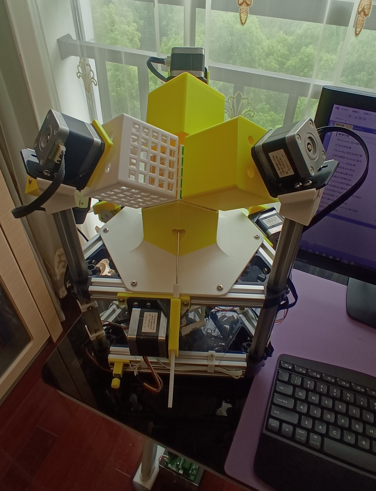
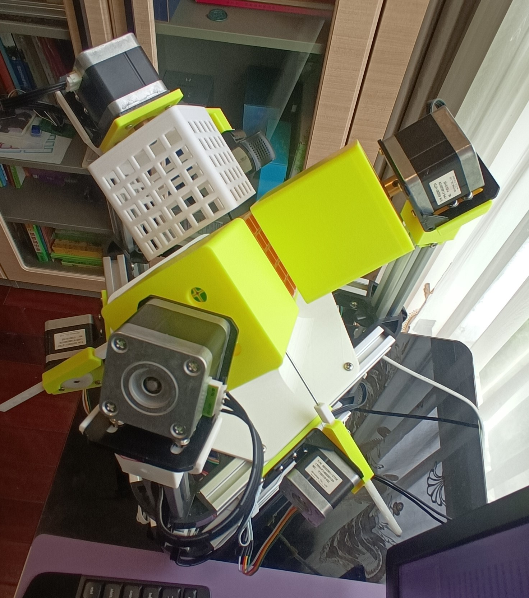
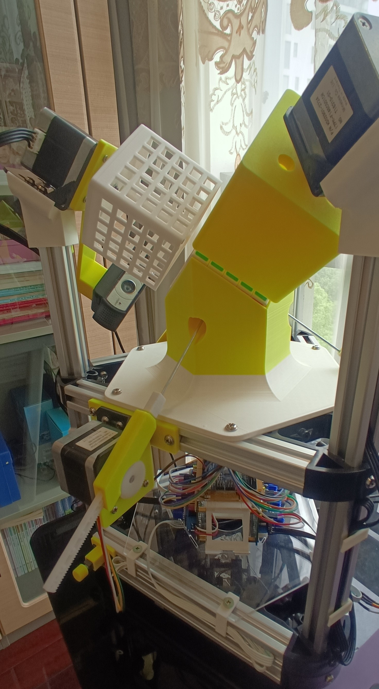
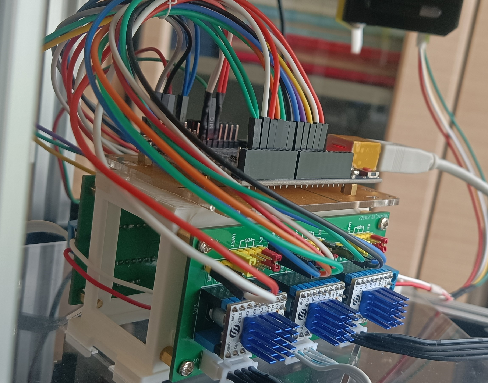

# 5x5x5 Cube solving machine

# 五阶解魔方机

一种自动复原5阶魔方的机器设计。A design of auto solving 5x5x5 cube machine.

*目前是已公开的最快的5阶解魔方机。The fastest 5x5x5 cube solving machine now.*

演示视频(demo video)：[三轴五阶解魔方机运行展示_哔哩哔哩_bilibili](https://www.bilibili.com/video/BV1yZ421n7nz/)

细节视频(detail video)：[3轴五阶解魔方机细节展示_哔哩哔哩_bilibili](https://www.bilibili.com/video/BV1LF4m1A7hH/)

### 1.整体架构

整个设计分为硬件和软件。

##### 1.1硬件部分

由框架、旋转器、推进器、arduino控制板和驱动板组成。

#### 1.2软件部分

由arduino下位机和PC上位机组成。

arduino下位机负责控制步进电机运动，PC上位机负责颜色识别、魔方求解、下位机控制等。

PC上位机使用VS2022 C#编写。

魔方求解使用了**陈霜**的五阶魔方算法，此算法是目前世界上最快的5阶算法，在此向他致敬！详情可以去他的github了解：[cs0x7f/cube555: 5x5x5 solver (github.com)](https://github.com/cs0x7f/cube555)，我也改写了c#版本：[hp1210cl/cube555-solver: C# version of Chen Shuang's Five-phase-reduction 5x5x5 solver (github.com)](https://github.com/hp1210cl/cube555-solver)。

颜色识别使用了EmguCV。

### 2.解魔方情况

对于一个打乱的5阶魔方，算法给出的步骤一般在70步左右。机器从识别-求解-复原全过程需耗时在90秒之内，典型时间75秒。

### 3.如何运行

#### 3.1硬件搭建

安装BOM清单准备好材料，按照图片成品组装。

#### 3.2下位机准备

将controller文件夹中的arduino程序刷入开发板。

#### 3.3运行上位机

将摄像头、arduino连接到PC，使用Visual Studio打开cubesolver文件夹下的工程文件，编译，运行。先打开摄像头，再在上位机控制选项卡页面连接开发板，再使能步进电机，进行机器的调试。

#### 3.4开始解魔方

如果出现卡滞，可以使用硬件紧急停止按钮，也可以使用上位机软件的急停按钮（有延时）。

### 4.调试细节

解魔方机需要精确调试才能顺利运行，具体调试详见调试文档。

### 
